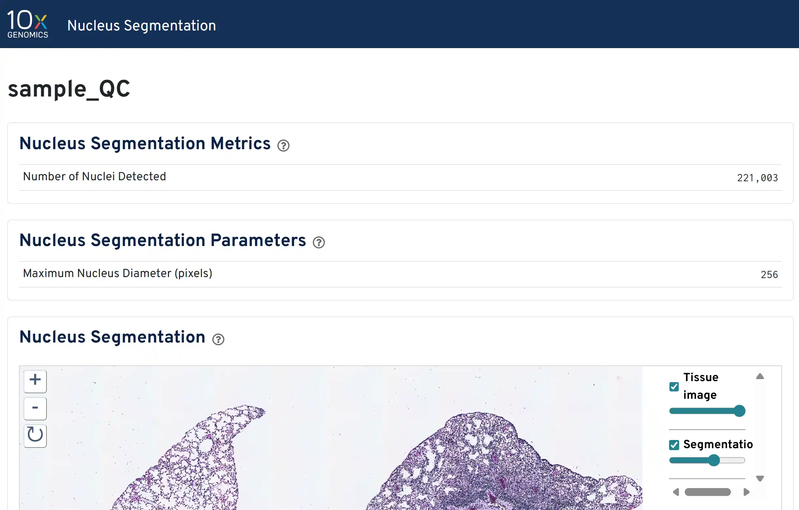

# Visium HD Nuclear Segmentation QC on Windows (WSL2)

A complete workflow for running `spaceranger segment` on Windows using WSL2,

designed for researchers who do not have access to a dedicated Linux workstation.

This workflow covers:

1. Cropping a 6.5 × 6.5 mm H&E region from a whole-slide image using QuPath
2. Running `spaceranger segment` in WSL2 (Ubuntu 22.04)
3. Interpreting the output for RNA per cell QC

---

## Background

`spaceranger segment` (available since Space Ranger v4.0) performs nuclear

segmentation on H&E images to estimate cell counts — a key QC step before

committing samples to the Visium HD assay.

> **Important:** `spaceranger segment` cannot be run on 10x Genomics Cloud.
>
> It must be run locally on a Linux environment.
>
> Reference: *CG001678 Visium HD FFPE Tissue Preparation Handbook 2.0*

10x Genomics official documentation assumes a bare-metal Linux workstation.

This guide fills the gap for Windows users.

---

## Hardware Requirements

### 10x Genomics Official Requirements (Space Ranger 4.x)

| Component | Minimum                                   | Recommended |
| --------- | ----------------------------------------- | ----------- |
| CPU       | 8-core Intel/AMD (AVX support required)   | 32 cores    |
| RAM       | 64 GB                                     | 128 GB      |
| Storage   | 1 TB free                                 | —          |
| OS        | 64-bit CentOS/RedHat 7.0 or Ubuntu 14.04+ | —          |

> **Note:** WSL2 is **not** officially supported by 10x Genomics.
>
> The above requirements are for `spaceranger count` (full pipeline).
>
> `spaceranger segment` (image-only, no genome alignment) requires
>
> significantly less RAM in practice.

### Tested Configuration (spaceranger segment only)

| Component  | Spec                    | Notes                                    |
| ---------- | ----------------------- | ---------------------------------------- |
| Machine    | HP EliteBook 835        | Windows 11 Pro                           |
| CPU        | AMD Ryzen Pro (8 cores) | AVX2 supported                           |
| RAM        | 32 GB physical          | WSL2 allocated 24 GB                     |
| WSL2 Swap  | 8 GB                    | Configured in `.wslconfig`             |
| Storage    | Micron P310 NVMe SSD    | External, files copied to WSL2 native FS |
| OS (WSL2)  | Ubuntu 22.04 LTS        | —                                       |
| Image size | 1.7 GB TIFF             | 6.5 × 6.5 mm @ 0.26455 µm/px           |
| Runtime    | ~17 minutes             | 8 cores / 20 GB RAM                      |

> ⚠️ **16 GB RAM machines (e.g. Surface Pro 9) are not recommended.**
>
> Standard Visium HD H&E images (~1.7 GB) may exceed available WSL2 memory.
>
> 32 GB physical RAM is the practical minimum for reliable execution.

---

## Software Requirements

* [QuPath 0.6+](https://qupath.github.io/) (Windows)
* [Space Ranger 4.0+](https://www.10xgenomics.com/support/software/space-ranger/downloads) (installed in WSL2)
* WSL2 with Ubuntu 22.04

---

## WSL2 Setup

### 1. Install WSL2

```powershell
# Run in PowerShell (Administrator)
wsl --install -d Ubuntu-22.04
```

### 2. Configure memory allocation

Create or edit `C:\Users\<your_username>\.wslconfig`:

```ini
[wsl2]
memory=24GB
processors=8
swap=8GB
```

Restart WSL2 after editing:

```powershell
wsl --shutdown
wsl
```

Verify memory allocation inside WSL2:

```bash
free -h
# Should show ~23 GB total
```

### 3. Install Space Ranger

```bash
# Create working directory inside WSL2 native filesystem (NOT /mnt/)
mkdir -p ~/spaceranger_work/input
mkdir -p ~/spaceranger_work/output

# Download Space Ranger from 10x Genomics website (requires login)
# Then extract:
cd ~/spaceranger_work
tar -zxvf spaceranger-4.x.x.tar.gz

# Verify installation
~/spaceranger_work/spaceranger-4.x.x/spaceranger --version
```

> ⚠️ **Critical:** Always use the WSL2 native filesystem (`~/`, `/home/user/`)
>
> as the working directory. Never run spaceranger with input/output on
>
> `/mnt/d/` or other Windows-mounted paths — the NTFS filesystem does not
>
> support Linux symlinks, which will cause Martian runtime errors:
>
> `symlink ... operation not permitted`

---

## Step 1: Crop H&E Image in QuPath

### Why crop?

Whole-slide images are typically stored as compressed formats (e.g. SVS ~500 MB).

However, exporting a region as uncompressed TIFF expands the file significantly.

A 6.5 × 6.5 mm crop at full resolution (\~0.26 µm/px) produces a file of  **~1.5–2 GB** .

Cropping is still necessary because:

* `spaceranger segment` requires a standard TIFF input, not SVS or other WSI formats
* Processing the full slide would require far more memory and time
* Only the region corresponding to the Visium HD capture area is relevant for QC

### 1a. Identify the region of interest

Use **Objects → Annotations → Specify annotation** to place a precise

6500 × 6500 µm rectangle on your tissue:

```
Objects
└── Annotations...
    └── Specify annotation
        ├── X: <left edge position in µm>
        ├── Y: <top edge position in µm>
        ├── Width:  6500
        └── Height: 6500
```

Adjust X/Y until the rectangle covers your tissue of interest.

The annotation will appear on the image for visual confirmation.

### 1b. Check pixel size (first time only)

Run this snippet in  **Automate → Script Editor** :

```groovy
def server = getCurrentServer()
def ps = server.getPixelCalibration().getAveragedPixelSizeMicrons()
print "Pixel size: ${ps} µm/px"
```

Record this value. For the same scanner, it will not change between slides.

### 1c. Export the cropped region

Select your annotation in the Annotations panel, then run `crop_visiumHD.groovy`

in the Script Editor (see [`scripts/crop_visiumHD.groovy`](scripts/crop_visiumHD.groovy)).

**Each slide, only edit these three lines:**

```groovy
def centerX_um = 3132.14   // Centroid X µm from Annotations panel
def centerY_um = 4745.63   // Centroid Y µm from Annotations panel
def outputFile = new File('C:/Users/<username>/Desktop/cropped_HE.tif')
```

The Centroid X/Y µm values are shown in the left panel after selecting the annotation.

**Expected output size:** ~1–2 GB uncompressed TIFF at full resolution

---

## Step 2: Transfer Image to WSL2

```bash
# Copy from Windows-mounted SSD into WSL2 native filesystem
cp /mnt/d/visium_QC/cropped_HE.tif ~/spaceranger_work/input/

# Verify file integrity
ls -lh ~/spaceranger_work/input/
```

---

## Step 3: Run spaceranger segment

```bash
~/spaceranger_work/spaceranger-4.1.0/spaceranger segment \
  --id=sample_QC \
  --tissue-image=/home/<username>/spaceranger_work/input/cropped_HE.tif \
  --output-dir=/home/<username>/spaceranger_work/output \
  --localcores=8 \
  --localmem=20
```

> **Note:** Use absolute paths (e.g. `/home/jychen/...`) instead of `~/`.
>
> The `--tissue-image` argument does not expand `~` correctly.

**Expected runtime:** 15–30 minutes for a 1.7 GB image on 8 cores / 20 GB RAM

### Outputs

```
output/outs/
├── nucleus_instance_mask.tiff     # Per-nucleus segmentation mask
├── nucleus_segmentations.geojson  # Nucleus boundary coordinates
└── web_summary.html               # QC report (open in browser)
```

---

## Step 4: View Results

Copy the web summary to Windows:

```bash
cp /home/<username>/spaceranger_work/output/outs/web_summary.html /mnt/d/visium_QC/
```

Open `web_summary.html` in any browser. Key metric:

```
Nucleus Segmentation Metrics
└── Number of Nuclei Detected: XXXXXX
```

---

## Step 5: Calculate RNA per Cell

Per the 10x Genomics official QC protocol ( *CG001678* ):

```
RNA per cell (pg) = Total RNA in 5 µm section (pg) ÷ Number of Nuclei Detected
```

### Decision thresholds (10x Genomics official)

| RNA per cell   | Interpretation      | Recommendation       |
| -------------- | ------------------- | -------------------- |
| < 0.4 pg       | Poor sample quality | Do not proceed       |
| 0.4 – 0.75 pg | Moderate quality    | Proceed with caution |
| > 0.75 pg      | Good quality        | Proceed              |

### Example calculation

```
Total RNA: 1,725 ng in 5 µm section
          = 1,725,000 pg

Nuclei detected: 221,003

RNA per cell = 1,725,000 ÷ 221,003 = 7.8 pg/cell → Proceed ✅
```

---

## Example Output

A successful run produces the following web summary:



Key metric to record for RNA per cell calculation:

```
Nucleus Segmentation Metrics
└── Number of Nuclei Detected: 221,003
```

---

## Troubleshooting

| Error                                               | Cause                                 | Fix                                                  |
| --------------------------------------------------- | ------------------------------------- | ---------------------------------------------------- |
| `symlink ... operation not permitted`             | Working directory on NTFS (`/mnt/`) | Move all files to WSL2 native FS                     |
| `No such file or directory`for `--tissue-image` | `~`not expanded                     | Use full absolute path `/home/user/...`            |
| `unexpected argument '--image'`                   | Wrong flag name in SR 4.x             | Use `--tissue-image`                               |
| OOM / process killed                                | WSL2 RAM too low                      | Increase `.wslconfig`memory, reduce `--localmem` |
| Martian UI not accessible in browser                | WSL2 network isolation                | Normal — does not affect execution                  |

---

## References

* [Space Ranger System Requirements](https://www.10xgenomics.com/support/software/space-ranger/downloads/space-ranger-system-requirements)
* [spaceranger segment documentation](https://www.10xgenomics.com/support/software/space-ranger/latest/analysis/running-pipelines/space-ranger-segment)
* [CG001678 Visium HD FFPE Tissue Preparation Handbook 2.0 (10x Genomics)](https://www.10xgenomics.com/support/spatial-gene-expression-hd/documentation/steps/tissue-prep-for-ffpe/visium-hd-ffpe-tissue-preparation-handbook-2-0)
* [CG001679 Visium HD Spatial Gene Expression 2.0 User Guide (10x Genomics)](https://www.10xgenomics.com/support/cn/spatial-gene-expression-hd/documentation/steps/library-construction/visium-hd-spatial-gene-expression-reagent-kits-user-guide-2-0)

---

## License

MIT
